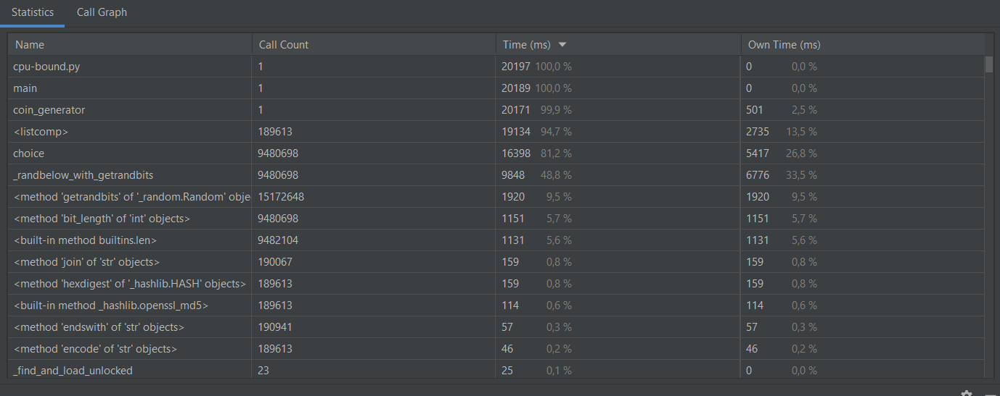

* Замерьте время синхронной проверки ссылок.
* Перепишите код, используя `ThreadPoolExecutor`. 
* Изменяйте количество воркеров: 5, 10, 100.
* Во время работы посмотрите с использованием стандартных утилит вашей OC загрузку памяти, процессора, сети, время работы. Зависят ли они от количества воркеров и как?
  
  * 5 workers: 96.50568079948425 seconds
  * 10 workers: 25.422240495681763 seconds
  * 100 workers: 18.888001918792725 seconds 

* Замерьте скорость герации на 1 ядре у вас на компьютере.
* Ускорьтесь за счет использования `ProcessPoolExecutor`.
* Изменяйте количество воркеров: 2, 4, 5, 10, 100.
* Во время работы посмотрите с использованием стандартных утилит вашей OC загрузку памяти, процессора, сети, время работы. Зависят ли они от количества воркеров и как?
* Убедитесь в том, что так как задача CPU bound, наращивать количество воркеров, большее количества ядер, бесполезно.

Время генерации на 1 ядре

2 workers : 

4 workers: 

10 workers: 

100 workers:

Как можем видеть, особых изменений при работе программы с разным количеством процессов не было.
Разброс по времени связан с рандомом.